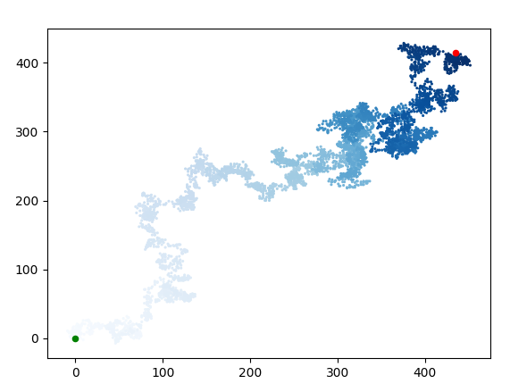
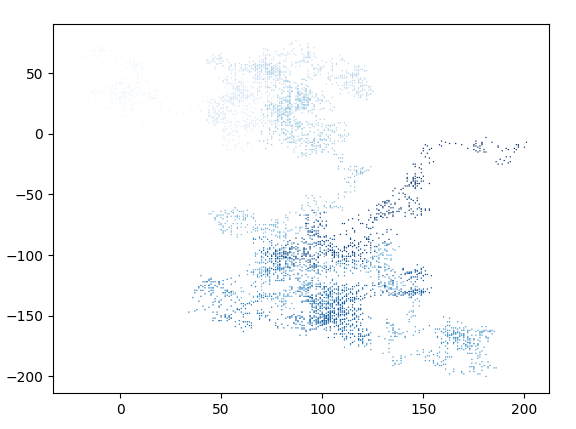
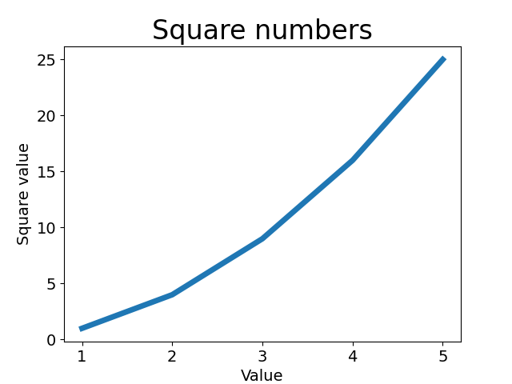
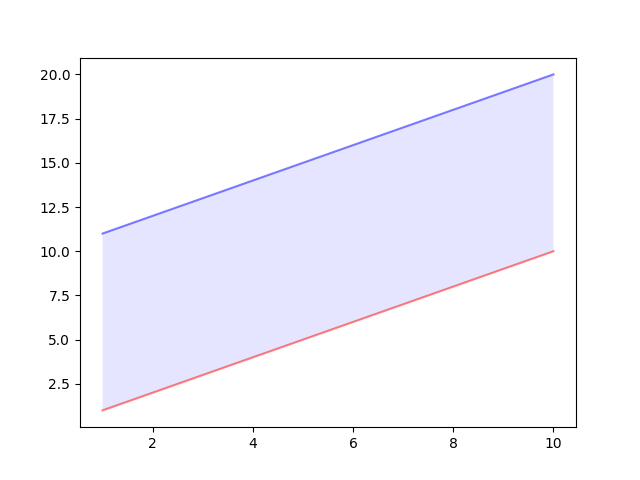
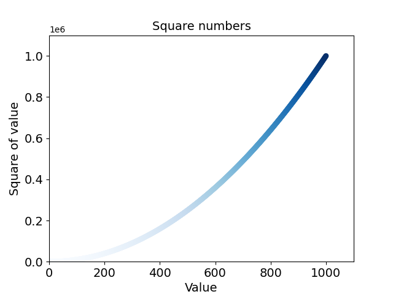
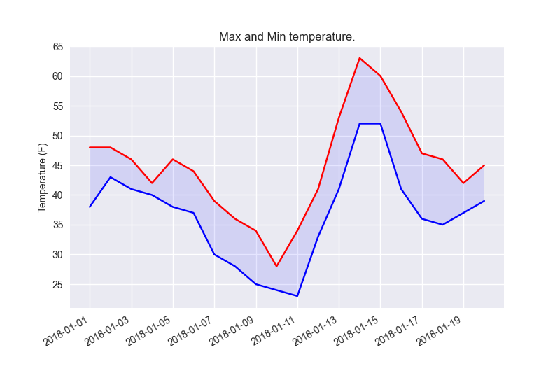
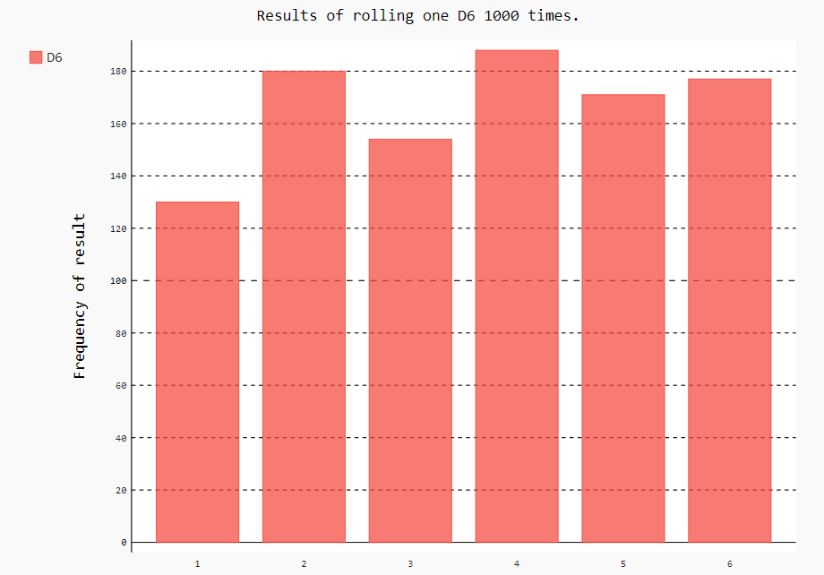
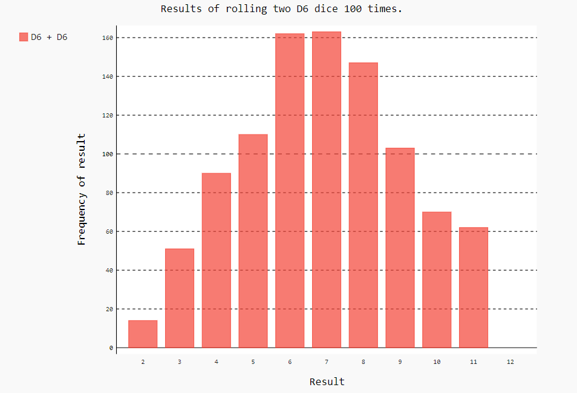
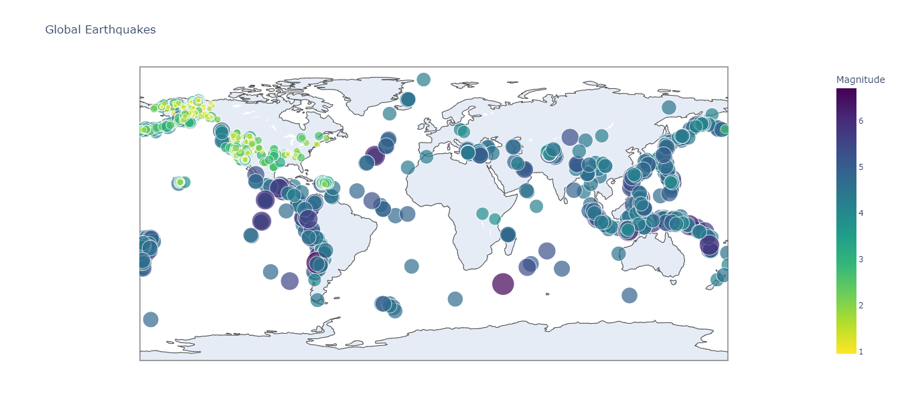

# Graficos-Python 🐍🐍🐍

> ### Este é um breve estudo sobre gráficos de python, contidos no livro: **Curso intensivo de Python**

# Gráficos 

> ### **Matplotlib**
> 1. _grafico_aleatorio_ 
> 2. _graficoAleatorioComPontos_ 
> 3. _graficoBasico_ 
> 4. _graficoComDuasLinhas_ 
> 5. _graficoComPontos_ 
> 6. _graficoTemperaturaCsv_ 

> ### **Pygal**
> 1. _Um dado lançado 1000 vezes_ 
> 2. _Dois lançado 100 vezes_ 

> ### **Potly**
> 1. _Terremotos na terra em 30 dias (Json)_ 